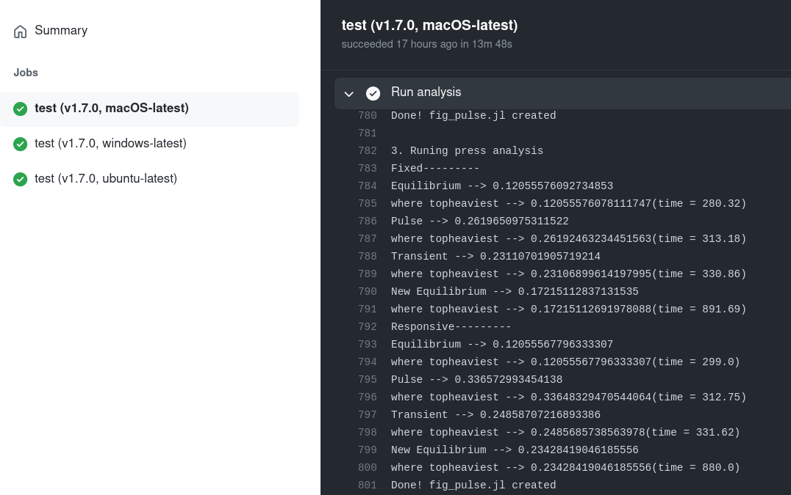

#### :mega: This post was first published on [mccannlab.ca](https://mccannlab.ca/post/2021/12/13/releasing-the-research-compendium-for-our-labmnivory-paper/).

Good news everyone! This week, our "Labmnivory" paper led by [Marie Gutgesell](https://www.researchgate.net/profile/Marie-Gutgesell) has been accepted in [Bioscience](https://academic.oup.com/bioscience). Therefore, the time has come to release the code we promised explicitly in the manuscript.

> Code for theoretical investigations will be made available on GitHub and archive on Zenodo upon manuscript acceptance. 

For [reproducibility](https://www.ncbi.nlm.nih.gov/books/NBK547546/)'s sake, we've structured our [Julia](https://julialang.org/) scripts as a [research compendium](https://research-compendium.science/) which so far has been [hosted on GitHub](https://github.com/McCannLab/Labmnivory/), in a private repository. The goal of this post is to go over the different steps to have our research compendium archived on [Zenodo](https://zenodo.org/). Having the full set of scripts used to obtain the results of a given study archived publicly somewhere doesn't hurt! If you skip this step, you may end up in a situation where someone is trying to reproduce your results and is failing at it... In such case, it is most likely that you will feel very bad not being able to find the original code! 

## 1. Make the repository public 

As mentioned above, for our theoretical investigations, we worked on a private GitHub repository. Working on a private repository isn't really necessary -- I don't think it would have changed anything if we had been working on a public one for this study -- but it is sort of a convenient way to distinguish projects: the ones that are under active development remain private and the ones that are either ready to be published, accepted or already published are public.

The important point here is that archiving the content of a GitHub repository on Zenodo is super easy, but to do so, the repository *must* be public. Assuming there isn't any problem with this, the way to proceed is straightforward and well-documented on [GitHub documentation](https://docs.github.com/en/repositories/managing-your-repositorys-settings-and-features/managing-repository-settings/setting-repository-visibility). By the way, turning the repository into a public one makes one Octocat very happy (on Slack) :arrow_down:.



## 2. Cleaning up the repository

In the best-case scenario, our code has been clean since day one and has remained so until the day of manuscript acceptance. We are rarely working under this scenario, therefore cleaning up your repository before publishing is an important step. 

Sharing our code is good for [several reasons](https://towardsdatascience.com/how-and-why-to-share-scientific-code-64fbd385a67), but if it means sharing a bunch of scripts more or less structured, poorly documented and bundled together with chunks of old/legacy/unused code... all the efforts become futile. We may still be able to use your code the day you release but it is likely that nobody else could (at least, not within a reasonable amount of time), and "nobody" actually includes future us...

Even though it is an important step, I don't think it is worth spending days on this. Note that with [good habits](https://www.hongkiat.com/blog/developer-habits/), the time spent on this task is much reduced. Note that although we aren't professional programmers, various programming principles are simple enough to be adopted, e.g
  - ["two or more use a for"](https://en.wikipedia.org/wiki/Edsger_W._Dijkstra),
  - [DRY](https://en.wikipedia.org/wiki/Don%27t_repeat_yourself) (Don't repeat yourself).

But even without such habits, one can simply go over a simple check list. I think the one below gives an idea of the sort of things to be considered. 

1. Use a logical file structure for the repository. Our [repository](https://github.com/McCannLab/Labmnivory/) has a simple structure that suits our needs: `src/` for the code (as for a [Julia's package](https://pkgdocs.julialang.org/v1/creating-packages/)) and `fig` for the figures. 
2. Add some guidelines pertaining to the usage of your code, with a GitHub repository, a natural file to do so is the README (see commit [19e08bb](https://github.com/McCannLab/Labmnivory/commit/19e08bb6c6795accfb268d96d217d8a3d93d11cd)).
3. Remove all unused code (see commit [74dd1f0](https://github.com/McCannLab/Labmnivory/commit/74dd1f048f5242fd8147045b2abe90519aeabf57) for an example). Note that if parts of the old code might be useful at some point for another project, copy-paste them and/or make sure it is included in a previous version of your code that will remain available;
4. Comment all numerical tricks. It is important to *not* being overconfident as it is hard to remember accurately everything we did. 

Again, the goal is to do as much as possible within a reasonable amount of time. I don't think it's worth spending days on choosing variable names or on the number of folders required... Plus, I seriously doubt there is a single best solution whereas I am very confident that there is a plethora of OK solutions. :warning: In case this was not clear, cleaning up the repository is not the time to modify the analysis, we are merely making cosmetic changes to the code to make it clearer.

## 3. Making sure we are able to reproduce the analysis

What we are trying to achieve here is to publish the code that was used to obtain the results we are publishing in a scientific article. The cleaning up shouldn't affect the analysis but it is possible that some of the minor changes we've made introduced an errors, e.g. a variable name has been changed and we forgot to replace the old name in a few places. So before releasing the code, it is important to double check that we are still obtaining the same results. 

Before manuscript submission, we ensured that the analysis runs seamlessly on more than one computer. On GitHub, [GitHub Actions](https://docs.github.com/en/actions) allows us to do so, but only on public repository (the time on GitHub's servers is limited for private repositories for free plans). The easy solution is to use another machine and check that the analysis runs correctly. But once we've made the repository public, the time limit is released and thus we can use GitHub Actions. For this study, the analysis has been checked on [three of the currently available runners](https://docs.github.com/en/actions/using-github-hosted-runners/about-github-hosted-runners) macOS Catalina, Ubuntu 20.04 and Windows Server 2019. 

The way this was set up is pretty simple, all the simulations have been gathered in one file, [`scr/pipeline.jl`](https://github.com/McCannLab/Labmnivory/blob/master/src/pipeline.jl) that orchestrates the analysis, and we are running the one command line on GitHub's servers (see [`reproduce.yaml`](https://github.com/McCannLab/Labmnivory/blob/b2581021f421cd62f433aac8310fc9610353c658/.github/workflows/reproduce.yaml#L29). 

Note that simulations for two of the supplementary figures were skipped. Mainly because those are time/energy consuming as the analysis for each of the figures takes approximately 2 hours to run (and I did not see the point of optimizing the code for this), so it means 12 hours on the servers (not even sure we are allowed to do that). Furthermore, the main piece of code use for these simulations is already used in previous steps of the analysis, so running the code that produces the other figures is a partial evidence that these simulations would work.  Note that even though these simulations were skipped, they are ready to be run (see [`pipeline.jl`](https://github.com/McCannLab/Labmnivory/blob/60117e3868e7e90580e3fef3f344466e92c4d4b3/src/pipeline.jl#L44-L50)).

## 4. Create a release with Zenodo 

As explained on [Wikipedia](https://en.wikipedia.org/wiki/Zenodo)

> Zenodo [...] allows researchers to deposit research papers, data sets, research software, reports, and any other research related digital artefacts. For each submission, a persistent digital object identifier (DOI) is minted, which makes the stored items easily citeable.

There are various tutorials online that explain how to upload your archive (e.g. this one on [instruct-eric.eu](https://instruct-eric.eu/help/other/zenodo-upload-guidelines)), but if you are using GitHub it's even simpler. Zenodo is indeed capable of archiving a GitHub's release and it uses all information on your GitHub repository to fill out the description fields. So once you have [linked your GitHub account to Zenodo](https://docs.github.com/en/repositories/archiving-a-github-repository/referencing-and-citing-content), it literally takes 2 minutes to obtain a DOI for your archive. There are several tutorials that explain how to use Zenodo with GitHub, see for instance the video below.



That's basically what we've done and we obtained the following . 
Below is the Zenodo page of our archive.

We've added the Zenodo badge on the README of the repository and once we get the DOI for the paper, we'll simply add it too, so people that stumble into our repository can easily find the actual paper. 

## 5. Add the new text in the manuscript

In the manuscript we added the following sentence

> Code for theoretical investigations will be made available on GitHub and archive on Zenodo upon manuscript acceptance. 

Now we've done our work, we not only have a GitHub repository to share but also a DOI associated with a Zenodo archive of our code. The final step is to let readers know about these two (or only the Zenodo DOI). 

> The code to reproduce this study is available as an archived compendium (https://doi.org/10.5281/zenodo.5776233) and the corresponding development repository is available at the following URL https://github.com/McCannLab/Labmnivory. 

We're done! One more reproducible study! 

## Last remark 

It takes some time to tidy up the repository, ensure that the analysis is reproducible, but it is :100:% worth it.
