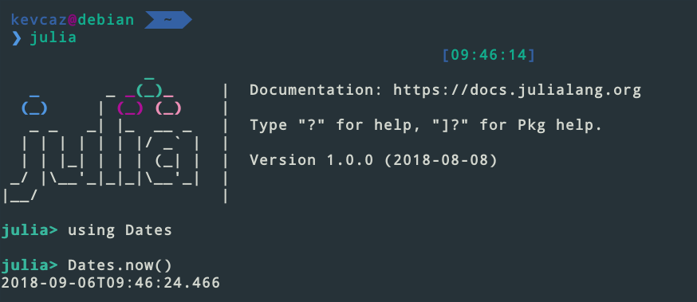

You may have already heard about [Julia](https://julialang.org/). Well, I am not
(yet) a regular user but Julia's performances are impressive, the langage is
well-thought and the community is growing super fast, I therefore pay careful
attention to what's happening on their side. Recently, [version 1.0.0](https://juliacomputing.com/press/2018/08/10/Julia-1.0-Released.html)
was released, so I decided to replace my [local version v0.4.7.9](https://packages.debian.org/fr/strecth/julia) I installed with `apt-get` (note that currently [v0.7.0-2 is available for Sid](https://packages.debian.org/fr/sid/julia)).

There are two ways to install Julia for Debian without `apt-get`.
First one is to go on the website and download the [Generic Linux Binaries for x86](https://julialang.org/downloads/platform.html#generic-binaries). Second
is to follow the guidelines on the [README file of the Github repository](https://github.com/JuliaLang/julia) to compile Julia from sources. That is what I did, starting by cloning the repository:

```sh
git clone https://github.com/JuliaLang/julia.git
```

This took a couple of seconds, then I switched to version 1:

```sh
git checkout v1.0.0
```

And then, I used the makefile:

```sh
make
```

It took some time:

```sh
REPL  ───────────  1.126812 seconds
Statistics  ─────  0.311747 seconds
Stdlibs total  ── 65.668191 seconds
Sysimage built. Summary:
Total ───────  88.168324 seconds
Base: ───────  22.498423 seconds 25.5176%
Stdlibs: ────  65.668191 seconds 74.4805%
    JULIA usr/lib/julia/sys-o.a
Generating precompile statements... 762 generated in  37.767039 seconds
    LINK usr/lib/julia/sys.so
    CC usr/lib/libccalltest.so
>>> elapsed time 1h18m10s
```

**1h18m10s**! As mentioned on the README: "Building Julia requires about 5GiB of
disk space and approximately 2GiB of virtual memory". After the build,
`./julia` worked just fine and to ease my use of Julia, I added an alias in
my `.zprofile`:

```sh
alias julia='~/Github/Applications/julia/julia'
```

So, now when I enter `julia` in my terminal, I get:





Youhou! :fireworks: :fire: :star2:  :fireworks: :fire: :star2:
