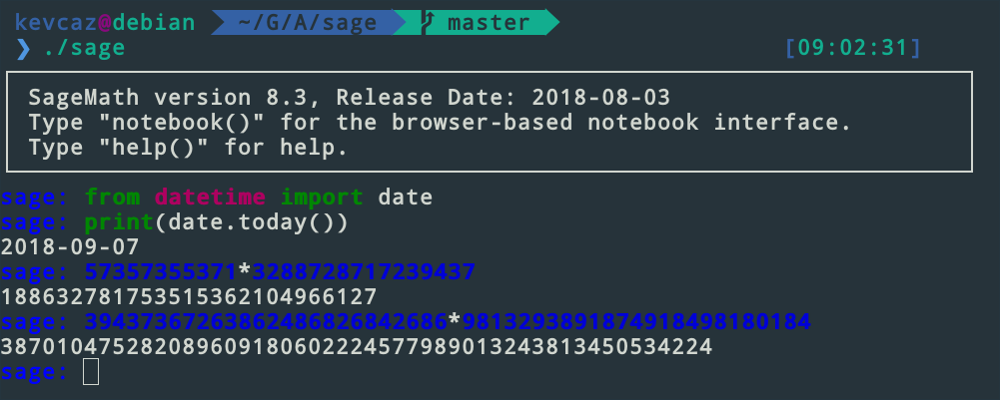

[Sage](http://www.sagemath.org/) is a powerful mathematics software I use
to do symbolic computation. Currently, there is no version available for Debian
Testing, meaning you can either [install the version available for the stable
release or cherry pick the package available for Sid](https://packages.debian.org/search?keywords=sagemath).
Well I was not able to `sudo apt-get` the package for Stretch so I decided
to use the same approach as I did for Julia (see [this previous note](/notes/julia/juliav1)).
Basically, the sources of sage are [mirrored on Github](https://github.com/sagemath/sage)
so one can clone the repository:

```sh
$ git clone https://github.com/sagemath/sage.git
```

and then use the Makefile

```sh
$ make
```

It took some time :hourglass:


```sh
[...]

Testing that Sage starts...
[2018-09-07 00:22:10] SageMath version 8.3, Release Date: 2018-08-03
This looks like the first time you are running Sage.
Cleaning up, do not interrupt this.
Done cleaning.
Yes, Sage starts.
make[3]: Leaving directory '/home/kevcaz/Github/Applications/sage/build/make'
make[2]: Leaving directory '/home/kevcaz/Github/Applications/sage/build/make'

real	202m55.825s
user	211m15.591s
sys	12m46.227s
Sage build/upgrade complete!
make[1]: Leaving directory '/home/kevcaz/Github/Applications/sage'
>>> elapsed time 3h24m11s
```

After **3h24m11s**, everything works fine:



I created another alias and :boom: I'm ready to do maths!
