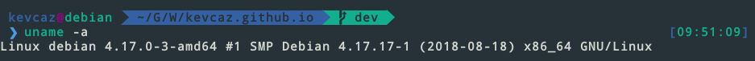
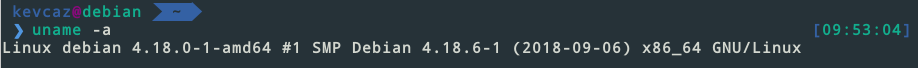

On Debian Testing today was a kernel update day! At **9:51am** (Guelph time)
I was still on kernel 4.17 :scream:

but at **9:53am**, I was working with 4.18 :trophy:

By the way, the source code of the kernel is mirrored on [Github](https://github.com/torvalds/linux),
a repository without an issue section with a $\infty$ number of contributors :joy:.
Also, there is an exhaustive documentation available at https://www.kernel.org/doc/html/latest/.
