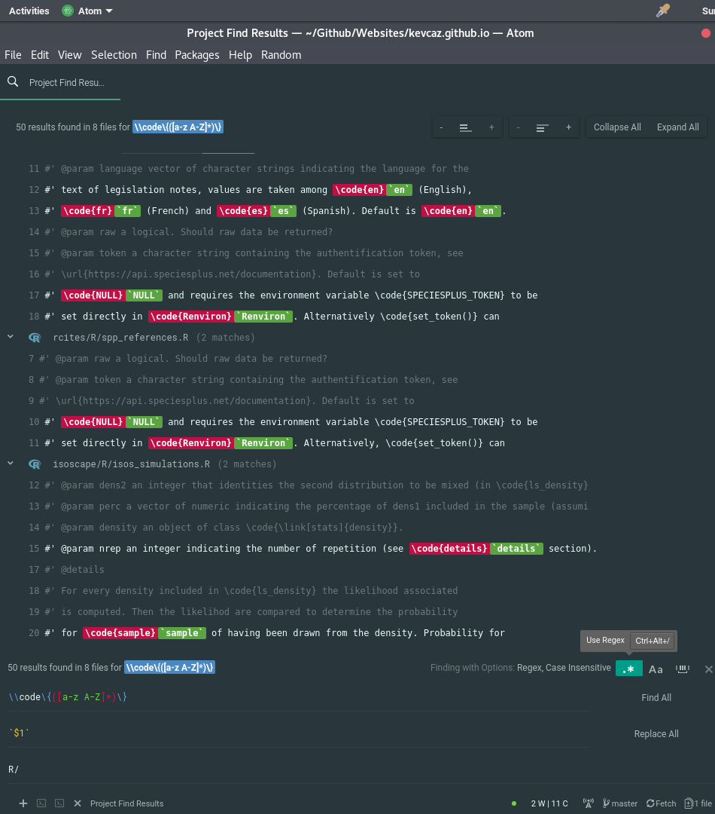

One specific feature of [Atom](https://atom.io/) I like is the "find and replace" for a specific folder (`ctrl+shift+F` by default on Debian).
It could be extremely powerful when the [regex](https://regexr.com/) mode is on.
Let me give you an example. Yesterday I had to replace all `\code{sometext}`
with `'sometext'` which represented dozens of matches in several files.
Well, it was not hard at all! All I had to do once the regex mode was on (see
where the pointer is on the image below) was to remember the right
regex:

```
  \\code\{([a-z A-Z]*)\}
```

A brief explanation:

- `\` is the [escape character](https://en.wikipedia.org/wiki/Escape_character)
- `[ ]` to select characters,
- `a-z` (`A-Z`) all lower (upper) case letters,
- `*` an arbitrary number of time the preceding pattern,
- the content within `( )` could be used as a variable `$1` (`$2` for the next pair
  of brackets, if any, and so forth).



The preview is also really helpful, as you can see if you are doing the right changes :smile:.
