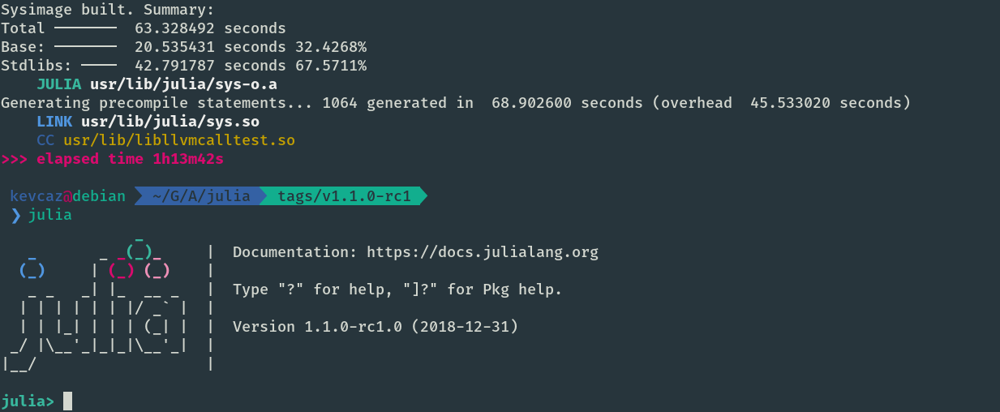

Learning more about Julia is one of the many things I attempt to do in 2019 :smile:. Few weeks ago, I [installed Julia 1.0.0](/notes/julia/juliav1/) using the GitHub repository and I decided to checkout how easy it would be to upgrade to the version to [v1.1.0-rc1](https://github.com/JuliaLang/julia/blob/v1.1.0-rc1/NEWS.md)
(note that "rc" stands for [release candidate](https://en.wikipedia.org/wiki/Software_release_life_cycle#Release_candidate)). It was quite easy, all I had to do was:

```
git checkout master
git pull
git checkout v1.1.0-rc1
make
```

1h13min42sec latter, julia 1.1 was installed.



Ok, so I know how to install, update and launch julia, so now I just have to learn everything else :smile:. In the [latest newsletter](https://juliacomputing.com/blog/2019/01/04/january-newsletter.html), there is a reference to [*Julia a fresh approach to computing* (2017)](https://julialang.org/publications/julia-fresh-approach-BEKS.pdf)* by the creators of Julia, I guess I'll start with reading this!
