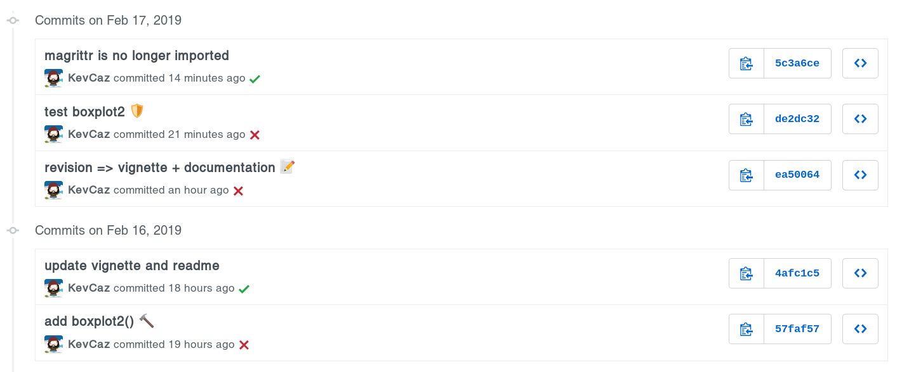

When you are working on a project with GitHub (or a similar web service based on <i class="fa fa-git" aria-hidden="true"></i>) that has tens of commits, using emoticons in commit messages makes the search in the history of your project very efficient. To add one emoticon to your commit message, you must use its name (check this [cheat sheet](https://www.webfx.com/tools/emoji-cheat-sheet/)) within colons in the commit message, e.g. "add this :emoticon_name:". Personally, I mostly use the following emoticon:

- :book: `book` add a new piece of documentation;
- :bar_chart: `:bar_chart:` add a new figure/plot/chart; 
- :pencil: `pencil` edit the documentation;
- :hammer: `hammer` add a new function (or a class, or a method, .etc);
- :gear: `gear` add a new argument to a function;
- :wrench: `wrench` improve the way a function is coded;
- :shield: `shield` add or edit a test;
- :floppy_disk: `floppy_disk` add or edit data;
- :wastebasket: `wastebasket` delete an file;
- :arrow_up: `arrow_up` new version;
- :bug: `bug` bug.


Let's say, my commit adds a new function to my project, then I'd write something like:

```sh
$ git commit -m "add fun() that does this :hammer:"
```

And if the function is fairly simple, I may commit the function together with the corresponding unit testing, in which case I'd write:

```sh
$ git commit -m "add fun() that does this and test it :hammer: :shield:"
```

As you can see, I add the commit at the end of the message. This looks something like this is my commit messages locally:




but it looks like this on GitHub!



<br>

Fun fact :smile_cat:, while I was writing this note, I was looking for posts on this topic and I found [Gitmoji](https://gitmoji.carloscuesta.me/)

> Gitmoji is an initiative to standardize and explain the use of emojis on GitHub commit messages.

I like it! It's similar to what I was doing before but much more exhaustive, I'll use for the next projects!
