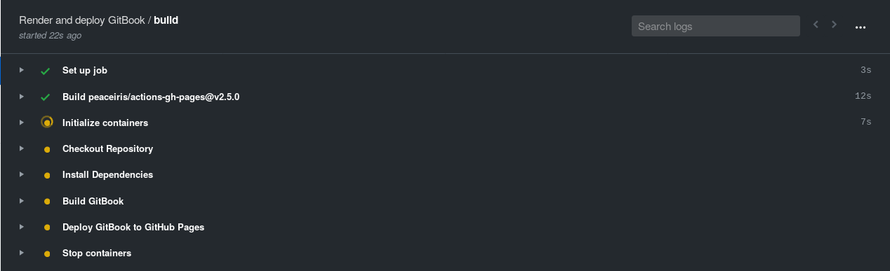
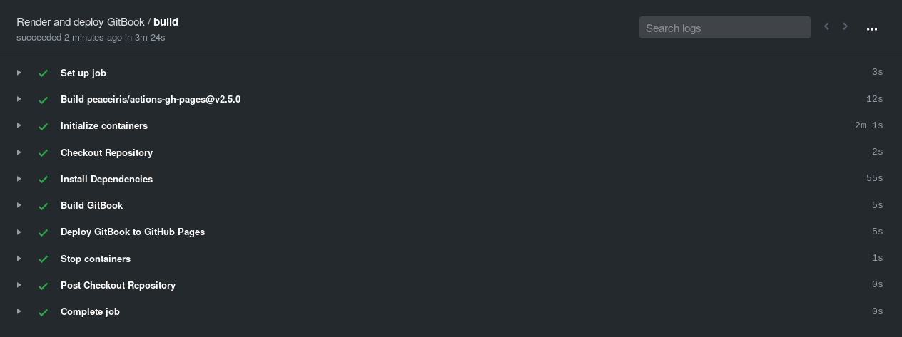

As explained on [GitHub](https://github.com/features/actions):

> GitHub Actions makes it easy to automate all your software workflows, now with world-class CI/CD. Build, test, and deploy your code right from GitHub. Make code reviews, branch management, and issue triaging work the way you want.

I've heard about this feature and I decided to give it a first go yesterday as I
wanted to deploy a notebook for the [McCann Lab's Theory
Club](https://github.com/McCannLab/TheoryClub) built with
[bookdown](https://bookdown.org/). As it uses the form of an R package, I figured
the easiest approach was to google "github actions R" and this is how I learned
about the R package [ghactions](https://github.com/r-lib/ghactions). This
package generates the file you need to set up your GitHub Actions workflow, i.e.
a [YAML file](https://en.wikipedia.org/wiki/YAML) in `.github/workflows`. Given
that the notebook I was deploying was a static website I opted for `website()`
as a workflow:


```R
R> library(ghactions)
R> use_ghactions(workflow = website())
```

With this first file in hand, I then examined the the [documentation](https://help.github.com/en/actions/automating-your-workflow-with-github-actions) as well as three GitHub repositories where I found valuable examples:

- https://github.com/jimhester/r-actions-test/blob/master/.github/workflows
- https://github.com/r-lib/ghactions/blob/master/.github/workflows/main.yml
- https://github.com/peaceiris/actions-gh-pages

and tweaked the file based on these! Below is the final version of my workflow (see [the file on GitHub](https://github.com/McCannLab/TheoryClub/blob/master/.github/workflows/main.yml)):


```yaml
name: Render and deploy GitBook
'on':
  - push
  - pull_request
jobs:
  build:
    runs-on: ubuntu-18.04
    container: rocker/verse:latest
    steps:
      - name: Checkout Repository
        uses: actions/checkout@master
      - name: Install Dependencies
        run: |-
          Rscript -e "install.packages(c('remotes', 'bookdown'), repos = 'https://muug.ca/mirror/cran/')"
          Rscript -e "remotes::install_deps(dependencies = TRUE, repos = 'https://muug.ca/mirror/cran/')"
      - name: Build GitBook
        run: |-
          Rscript -e "bookdown::render_book('index.Rmd', 'bookdown::gitbook')"
      - name: Deploy GitBook to GitHub Pages
        uses: peaceiris/actions-gh-pages@v2.5.0
        env:
          ACTIONS_DEPLOY_KEY: ${{ secrets.ACTIONS_DEPLOY_KEY }}
          PUBLISH_BRANCH: gh-pages
          PUBLISH_DIR: ./_book
```


which worked well:




After ~3min, the job was completed and the website deployed :tada:.




Something that is worth noticing is that it is designed to work with [Docker](https://www.docker.com/) which makes GitHub Actions quite powerful because setting up an environment becomes *almost* trivial! In my case, I basically needed Linux + R + publishing stuff, and this only required the following two lines (thanks to the great work of the [Rocker](https://www.rocker-project.org/) team :clap:):

```yaml
runs-on: ubuntu-18.04
container: rocker/verse:latest
```

The remaining steps are self explanatory. Note that to better understand how to deploy the website, I followed the guidelines available on the README of [the repository actions-gh-pages maintained by peaceiris](https://github.com/peaceiris/actions-gh-pages), that are very well laid-out[^deploy]. The last step was to add the badge, I used ghactions[^usethis] once more:

```
R> ghactions::use_ghactions_badge()
```

to generate the following badge[^badge]:

```markdown
[](https://github.com/McCannLab/TheoryClub/actions)
```

The workflow and the website are available [in the repository of the theory club](https://github.com/McCannLab/TheoryClub) and if you want to learn more about it, you should have a look at the [documentation](https://help.github.com/en/actions/automating-your-workflow-with-github-actions), there are also several blogposts introducing this feature (e.g. [one by Paul Czarkowski](https://tech.paulcz.net/blog/intro-to-github-actions/), [another by Austin Roy](https://scotch.io/bar-talk/introducing-github-actions))!

<!-- I may use this to deploy my website!  -->


[^usethis]: By the way, some R users may have noticed that this package uses the same semantic as the other [usethis](https://github.com/r-lib/ghactions)) functions :smirk:!

[^badge]: I simply edited the URL.

[^deploy]: And I used [peaceiris/actions-hugo](https://github.com/peaceiris/actions-hugo) for this website.
