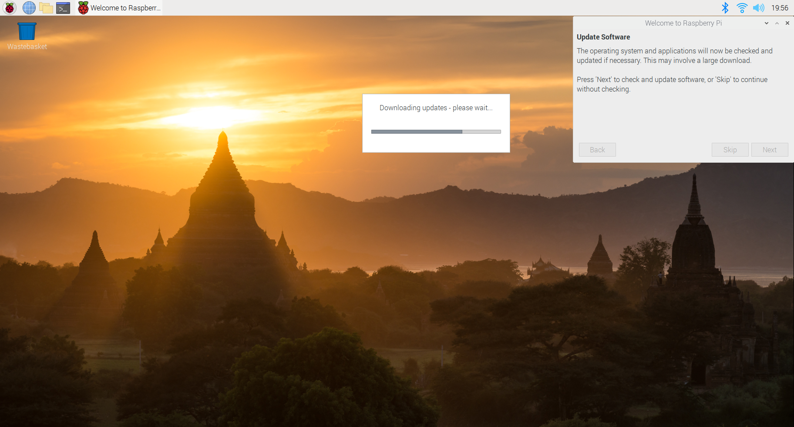

This last 3 weeks I updated my raspberry pi.
So now called Raspberry Pi OS. https://www.raspberrypi.org/downloads/raspberry-pi-os/ Briefly I just updated added [](https://www.raspberrypi.org/documentation/installation/installing-images/
), all instruction for [Linux](https://www.raspberrypi.org/documentation/installation/installing-images/linux.md)


# Installation

I took the full image so includeds

No big changes, makes stuff user friendly with a set of siple instruction on first boojt




Paeridodicly I update mine and simply see what avaialbel connec via ssh

And the documentation is getting better

- screenshto


Next

The full is pretty useful
like scrot for screenshot -- I know it's tiny stuffy but usefull.


https://www.raspberrypi.org/documentation/remote-access/ssh/passwordless.md

Basic installation

```sh
$ sudo apt-get install emacs r-base r-recommended r-base-dev julia pandoc inxi hugo imagemagick zshz
$ pip3 install radian
```

Here are the versions with dependies of packages I used it cover my neede mys packages will be installed.

```R
install.packages(c(""devtools", "mapview", "tidyverse"))
```


```sh
$ emacs --version
GNU Emacs 26.1
$ psql --version
psql (PostgreSQL) 11.7 (Raspbian 11.7-0+deb10u1)
$ pandoc --version
pandoc 2.2.1
Compiled with pandoc-types 1.17.5.1, texmath 0.11.1, skylighting 0.7.5
$ hugo version
Hugo Static Site Generator v0.54.0/extended linux/arm BuildDate: 2019-06-04T19:16:36Z
$ R --version
R version 3.5.2 (2018-12-20) -- "Eggshell Igloo"
$ julia --version
julia version 1.0.3
$ git --version
git version 2.20.1
$ python --version
Python 2.7.16
$ python3 --version
Python 3.7.3
$ convert --version
Version: ImageMagick 6.9.10-23 Q16 arm 20190101 https://imagemagick.org
```


For R, what I like to do is installing a minimal the following packages that install a fair amount of packages I install.


```sh
$ sudo apt-get install libgeos-dev libproj-dev libgdal-dev libudunits2-dev libcairo2-dev
```

```R
install.packages(c('devtools', 'tidyverse', 'mapview'))
```

I also installed vivaldi and firefox to give it a try
and tweak the swap.

```
100 -> 2048
```

Total installation


# ssh passwordless


https://www.raspberrypi.org/documentation/remote-access/ssh/passwordless.md

Then I just have an alias on my computer. say 192.168.1.11

```
alias gorasp='ssh -X 192.168.1.11'
alias gorasp='ssh -X pi@192.168.0.19'
getfromraps() {
  scp -rp pi@192.168.0.19:${1-./} $2
}
sendtoraps() {
  scp -rp pi@192.168.0.19:$1 ${2-./}
}
```

so I can easily downloads and access form it.


# Raspicast

Last as I was looking for a way to stream using raspberry, I found Raspicast.
that baically covers my needs.


https://www.instructables.com/id/Raspberry-Pi-As-Chromecast-Alternative-Raspicast/ baically


```sh
$ sudo apt-get install libjpeg8-dev libpng12-dev
$ git clone https://github.com/HaarigerHarald/omxiv
$ cd omxiv
$ make ilclient
$ make -j4
$ sudo make install
```


So basically a fair amount of soft... and


https://raspberrypi.stackexchange.com/questions/109430/how-can-i-watch-netflix-on-the-raspberry-pi-4

Very useful as it gives also access to all your file nicly on your phone so you can basically have all you file then, very useful


https://github.com/kusti8/chromium-build/releases/download/netflix-1.0.0/chromium-browser_56.0.2924.84-0ubuntu0.14.04.1.1011.deb

https://www.raspberrypi.org/forums/viewtopic.php?t=183576


omxplayer ==> vlc cvlc


## Interaction cell phone raspberry


Raspicast

omx remote simple and fair

https://play.google.com/store/apps/details?id=com.tencarssoftware.omxremote

vlc remore

https://github.com/insin/vlc_remote

https://play.google.com/store/apps/details?id=jbscript.vlcremote


https://www.instructables.com/id/Raspberry-Pi-As-Chromecast-Alternative-Raspicast/

tries r

https://github.com/vincelwt/RaspberryCast

but did not + work with youtuve dl nothing I cannot handled otherwise..


# Netflix

https://github.com/popcornmix/omxplayer


The issue.

Chromum is basic

https://fr.wikipedia.org/wiki/Chromium

Goodle adds to make Chrome
noitably one compient

https://chromium.googlesource.com/chromium/src/+/master/docs/chromium_browser_vs_google_chrome.md

https://en.wikipedia.org/wiki/Google_Chrome

https://en.wikipedia.org/wiki/Widevine

https://www.lifewire.com/chromium-and-chrome-differences-4172101


Startup vlc
http://pi.bek.no/autostartProgramOnBoot/


https://linuxize.com/post/how-to-setup-passwordless-ssh-login/